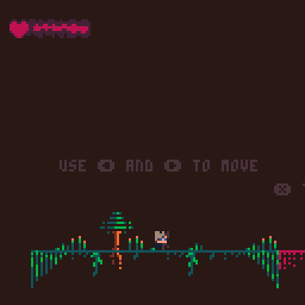

# first_pico8_game
This is my first Pico-8 game. It's a simple platformer  
Was my first time using pico8 and lua, so it's a bit messy.  
Proboably my worst open source project, but i'm kinda proud with the end result.  

<a href="https://www.lexaloffle.com/bbs/?tid=147012">
  <button>Play</button>
</a>

